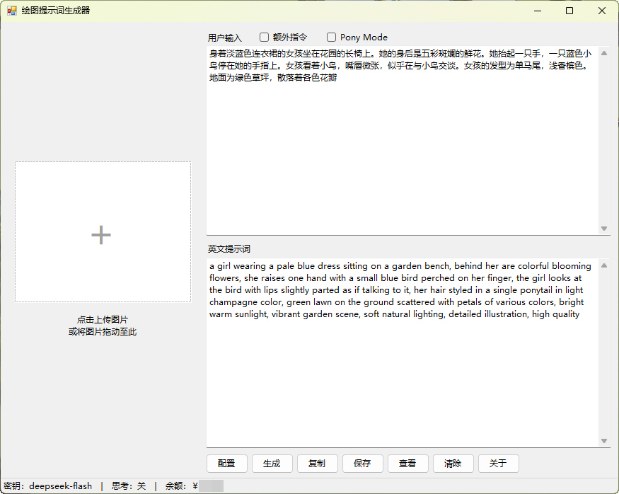
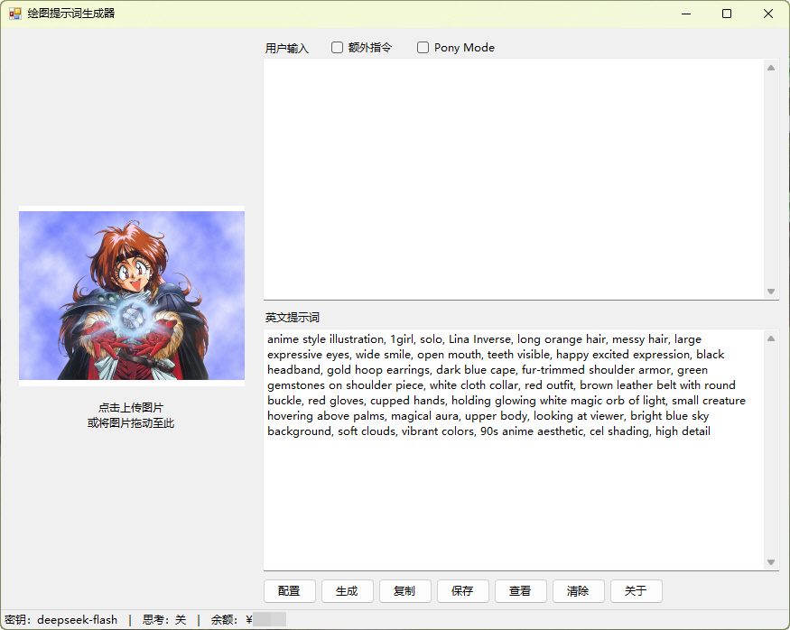
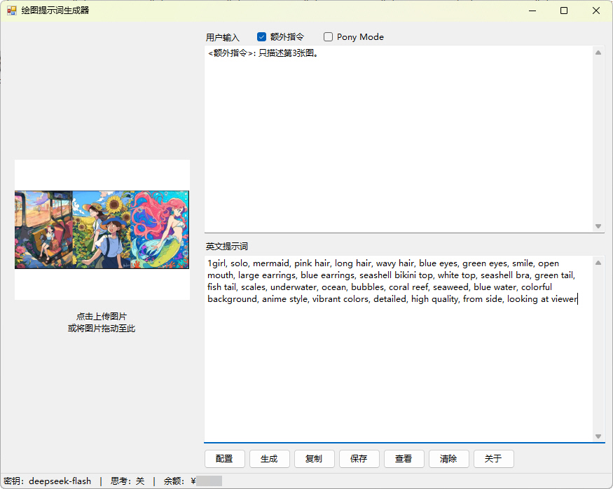
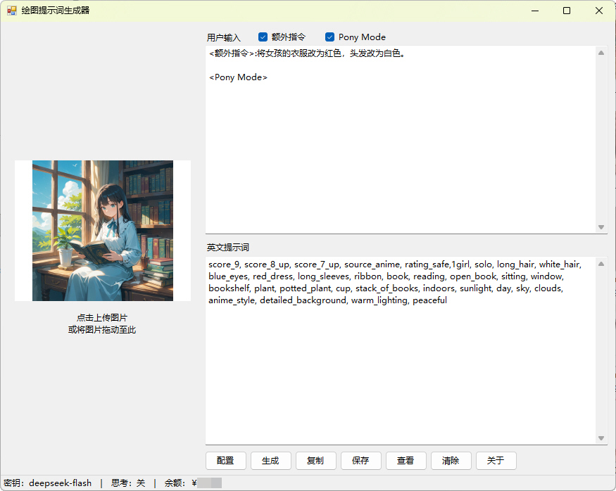
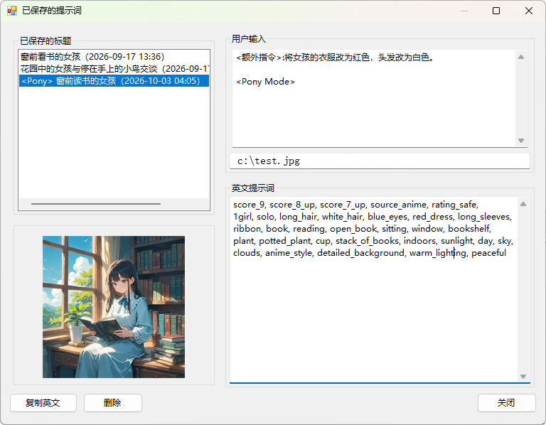

# 绘图提示词生成器

把文本描述或上传的图片，翻译 / 反推为英文绘图提示词（text-to-image prompt）的单机 Windows 桌面工具。并且可以根据用户的额外指令，对提示词进行相应修改。



## 特性

- **单窗口、单轮、无状态**：每次生成相互独立，不保留上下文
- **图片反推**：点击或拖拽上传**单张**图片（JPG / JPEG / PNG / WebP / BMP），可与文本配合，也可仅用图片
- **额外指令 / Pony Mode**：「额外指令」勾选后自动在输入末尾追加 `<额外指令>:` 标签；「Pony Mode」自动追加 `<Pony Mode>`（位于额外指令下方），输出 Pony 格式正面提示词，保存列表的标题带 `<Pony>` 前缀
- **系统提示词可自己改**：`prompt.txt` 纯文本，改完即生效，与任何外部工具链无关
- **文本区字号可选**：9 / 10 / 11 / 12 / 13 磅，只作用于主窗口与查看窗口的「用户输入」「英文提示词」
- **独立 API Key**：仅支持 DeepSeek，不与其它软件共享凭据，密文存储
- **面向本地绘图工作流**：忠实翻译 / 反推成人向（NSFW）内容，不做审查与软化
- **零第三方依赖**：系统自带 `csc.exe` 编译，单文件 `PromptGenerator.exe` 分发
- **成本极低**：每次生成提示词花费约为 0.001~0.002 rmb。

## 下载与运行

| 项 | 说明 |
|----|------|
| 下载 | [Releases](https://github.com/petrel-cn/prompt-generator/releases/latest) 中的 `PromptGenerator.exe` |
| 运行前提 | Windows 10 / 11（自带 .NET Framework 4.8 运行时） |
| 安装 | 无需安装：双击即用，无需 .NET SDK、Node 或任何第三方组件 |
| 首次使用 | 打开「配置」→ 填入 DeepSeek API Key → 回主窗口输入描述（或上传图片）→ 点「生成」或按 `Ctrl+Enter` |

## 界面说明

### 主窗口

左侧为图片上传区（固定 250×200，窗口缩放不改变尺寸），右栏为上「用户输入」、下「英文提示词」，底部状态栏显示：

```
密钥：DeepSeek ｜ 思考：关 ｜ 余额：￥110.00
```

- 按钮：`配置 / 生成 / 复制 / 保存 / 查看 / 清除 / 关于`（`清除` 位于 `查看` 与 `关于` 之间）
- 输入区头部：「用户输入」标签 + `额外指令` 复选框 + `Pony Mode` 复选框
- **图片上传**：点击上传框弹窗选图，或把图片文件拖到上传框/窗口任意位置；仅接受单张，新图覆盖旧图；无图时显示虚线框与「＋」，有图时显示缩略图（保持比例、完整显示）
- 上传校验：支持 `.jpg` / `.jpeg` / `.png` / `.webp` / `.bmp`（大小写不敏感）；单张上限 32 MiB；BMP 会在本地转码为 PNG 后上传；不支持的格式或超过上限时提示并保留当前图片
- **标签自动增删**：勾选「额外指令」在末尾追加 `<额外指令>: `（若已勾选 Pony Mode 则插入到 Pony 段上方）；勾选「Pony Mode」在末尾追加 `<Pony Mode>`；取消勾选时删除对应标签段。手动改写过标签导致匹配不到时，只改变复选框状态，不动文本
- **清除**：一键清空图片、输入与输出，并复位两个复选框（无二次确认）
- 点击状态栏区域可手动刷新余额；余额状态细分 `获取中…` / 具体金额 / `获取失败`（悬停可看失败原因）/ `未配置 Key`
- 生成期间全部按钮禁用，余额位置显示 `生成中…`；输入与图片均为空时提示「请先输入描述或上传图片。」
- 快捷键：`Ctrl+Enter` 触发生成
- `关于`：显示版本号、版权行与 MIT 许可证名/链接

三种典型用法的界面实拍（文字输入见页首截图）：

| 图片反推 | 图片反推 + 额外指令 | Pony Mode |
|:--:|:--:|:--:|
|  |  |  |
| 只上传图片，反推为英文提示词 | 上传图片 + 勾选「额外指令」，用文字限定要描述的范围 | 勾选「Pony Mode」，输出 Pony 格式正面提示词 |

### 配置对话框

| 项 | 说明 |
|----|------|
| 密钥名称 | 状态栏显示名，默认 `DeepSeek` |
| API Key | 密码框，可勾选「显示」查看 |
| 模型 | 默认 `deepseek-flash`，可自行更换 |
| 思考模式 | `关闭` / `低（low）` / `高（high）` / `最高（max）` |
| 字体大小 | `9 磅（默认）` / `10 磅` / `11 磅` / `12 磅` / `13 磅`，只作用于主窗口与查看窗口的「用户输入」「英文提示词」两个文本框 |
| 系统提示词 | 加载 `prompt.txt` 内容，可在此编辑 |
| 用记事本打开 | 先落盘再调用记事本编辑，关闭记事本后自动重新读取 |
| 恢复默认 | 文本框重置为内置默认提示词（需点「保存」才写入文件） |
| 测试连接 | 用当前填写的 Key 调用余额接口，成功显示余额 |
| 保存 / 取消 | 保存写回 `config.json` 与 `prompt.txt`；取消放弃修改 |

思考模式说明：关闭时请求体为 `"thinking": {"type": "disabled"}`；开启时传 `"thinking": {"type": "enabled"}` 与 `"reasoning_effort": "low|high|max"`。思考模式下 DeepSeek 会忽略 `temperature` 等采样参数，且时延与费用更高。

- 推荐关闭思考模式，以获得最高响应速度、最低费用，以及降低 NSFW 内容被拒的概率。

### 查看对话框

初始尺寸 800×800，可调整；窗口几何与分栏位置会持久化。左侧为记录列表（上）与缩略图（下），右侧上下分栏为上「用户输入」、下「英文提示词」，便于对照与二次修改。



- 左栏标题按 `标题（保存时间）` 显示，空标题显示 `无标题`；生成时输入含 `<Pony Mode>` 的记录前缀显示 `<Pony> `（示例：`<Pony> 窗台上的白猫（2026-10-03 21:30）`）
- 左栏下部为缩略图区（图片固定 250×200、等比居中，不随窗口缩放）；无缩略图时显示「（无缩略图）」
- 右侧「用户输入」框下方显示该记录的**原始图片路径**；未关联图片时显示「（该记录未关联图片）」
- 左右分隔线可拖动（左栏不小于 140 px、右栏不小于 260 px）；上下分隔线同样可拖动；缩到最小尺寸时分栏会自动钳制到合法范围
- 标题过长时列表下方出现横向滚动条；记录较多时出现纵向滚动条
- 复制英文、修改标题、删除（同步删除对应缩略图）、关闭；双击列表项把用户输入与英文提示词一并加载回主窗口（不回填图片）
- **修改标题**：弹出与「保存提示词」样式一致的对话框并自动填入原标题，光标停在末尾；只能修改用户自己输入的那段文字，列表显示时自动附加的 `<Pony>` 前缀与保存时间不会被改写（标题也可改为空，显示为「无标题」）
- 旧版本保存的记录没有用户输入，上栏会提示「（该记录保存于旧版本，未保存用户输入）」

## 构建

零依赖，使用系统自带的 .NET Framework 编译器：

```cmd
build.cmd
```

产物：`bin\PromptGenerator.exe`（图标由 `icon\prompt-generator.ico` 经 `/win32icon` 嵌入，资源管理器 / 任务栏 / 标题栏均取该图标）

## 数据目录

```
%APPDATA%\prompt-generator\
├── config.json     配置（API Key 为 DPAPI 密文，含主窗口与查看窗口几何、文本区字号）
├── prompt.txt      系统提示词（UTF-8 纯文本，可用记事本直接编辑）
├── saved.json      已保存的提示词（标题 / 用户输入 / 英文提示词 / 时间 / 图片路径 / 缩略图名 / 是否 Pony）
└── thumbs\         缩略图（每条带图记录一个 PNG，保存带图记录时才创建）
```

- 首次运行自动创建目录，并写入默认 `prompt.txt`（综合版英文）
- `prompt.txt` 每次生成前重新读取，改完即生效，无需重启；读写时统一归一化为 CRLF 换行（确定性归一化，不影响请求前缀的字节稳定性）
- **2.0 升级策略**：内置默认提示词已换为综合版英文，从旧版本升级时 `prompt.txt` 会直接重置为新默认，**不保留旧的自定义内容**（如需保留请提前备份）；旧 `config.json` 会自动补齐 `schemaVersion` 与 `viewWindow`
- 缩略图尺寸上限 250×200（等比缩放）；删除记录时同步删除对应缩略图，残留的孤儿文件无害
- API Key 使用 Windows DPAPI（作用域 CurrentUser）加密后以 Base64 存入 `config.json`，不落明文
- 更换 Windows 用户或机器后无法解密，程序会提示重新输入
- 程序目录内不写任何用户状态，卸载时删掉上述文件夹即可

## 接口

| 用途 | 方法与地址 |
|------|-----------|
| 生成 | `POST https://api.deepseek.com/chat/completions` |
| 余额 | `GET https://api.deepseek.com/user/balance` |

- 认证：`Authorization: Bearer <API Key>`
- 请求体显式 `"stream": false`
- **无图片时**：`user` 的 `content` 为字符串（与 1.x 逐字节一致）；**有图片时**：`content` 变为内容块数组 —— 用户文本非空时第一块为 `{"type":"text"}`，`image_url` 块固定放最后，图片以 base64 data URL 内联（BMP 已本地转码为 PNG）
- 图片只能放在 `user` 消息；不传 `detail`，不做本地缩放（服务端自动缩放到约 1300×1300、每图不超过 1024 token）
- 系统提示词固定为 `messages[0]`，逐字节不变（不注入时间戳/随机 ID），system 与 user 之间不插入额外消息，以保持前缀缓存友好
- 超时 30 秒；仅对 429 / 5xx / 网络异常重试（最多 2 次，指数退避），400 / 401 / 402 / 422 不重试

### 错误提示

| 状态码 | 界面提示 |
|--------|----------|
| 400 | 请求参数错误 + 服务端 `error.message` |
| 401 | API Key 无效或未配置（可直接跳转「配置」） |
| 402 | 账户余额不足 |
| 422 | 参数不合法，提示模型名可能已失效 |
| 429 | 请求过于频繁，请稍后重试 |
| 500 / 503 | 服务暂时不可用，请稍后重试 |
| 网络异常 | DNS / 连接 / TLS / 超时等具体原因 |

## 源码结构

| 文件 | 职责 |
|------|------|
| `Program.cs` | 入口；TLS 1.2 初始化；单实例互斥；全局异常兜底 |
| `MainForm.cs` | 主窗口；图片上传区与文本区布局；七个按钮编排；标签增删；状态栏；窗口几何持久化 |
| `ConfigForm.cs` | 配置对话框（密钥 / 模型 / 思考模式 / 字体大小 / 系统提示词） |
| `ViewForm.cs` | 查看对话框；缩略图与原始路径；修改标题；几何与分栏持久化 |
| `SaveDialog.cs` | 标题输入对话框（保存提示词与修改标题共用，可预填标题） |
| `DeepSeekClient.cs` | HTTP 调用层：文本/图片生成、余额、错误归一化、有限重试 |
| `ImageUtil.cs` | 图片读取、格式判定、BMP 转 PNG、大小校验、缩略图生成与删除 |
| `Storage.cs` | `config.json` / `prompt.txt` / `saved.json` 读写，DPAPI 加解密，`thumbs\` 管理，2.0 升级重置 |
| `JsonUtil.cs` | `JavaScriptSerializer` 薄封装 |
| `Defaults.cs` | 默认提示词、默认模型名、版本号与版权常量、标签常量与增删规则、显示映射 |
| `build.cmd` | 编译脚本（嵌入 `icon\prompt-generator.ico`） |
| `icon\` | 程序图标源文件（`prompt-generator.ico`） |
| `image\` | 界面截图（`main-01` 文生图、`main-02` 图片反推、`main-03` 图片反推配合额外指令、`main-04` Pony Mode、`save-01` 查看已保存的提示词） |
| `tests\` | 离线回归测试（`run.cmd` + `TestMain.cs`） |
| `LICENSE` | MIT 许可证（英文原文） |
| `CHANGELOG.md` | 更新日志 |

实现细节：

- 语言约束 C# 5（不使用内插字符串、`?.`、表达式体成员），由 .NET Framework 自带 `csc.exe` 编译
- JSON 使用系统自带 `System.Web.Extensions.dll` 的 `JavaScriptSerializer`；注意它把嵌套 JSON 数组反序列化为 `ArrayList`，接收时必须用 `IList`（`object[]` 会恒为 `null`）
- 网络请求在 `Task.Factory.StartNew` 的后台线程执行，通过 `Control.BeginInvoke` 回主线程更新界面
- 窗口几何在 `Resize` / `Move` 时标记脏位，800 ms 去抖后写入 `config.json`；最小化/最大化状态不记录；启动时校验坐标是否落在任一显示器可见区域内，越界则居中
- 查看窗口在 `FormClosing` 时直接写入 `viewWindow`（几何 + 左右/上下分栏位置），重新打开时按面板最小尺寸钳制后恢复，避免小屏恢复出不可用布局
- `config.json` / `prompt.txt` / `saved.json` 均采用「临时文件 + 替换」的原子写，异常路径下目标文件始终存在（旧内容或新内容），不会出现半截文件；缩略图为可再生成的附属数据，不走原子写

## 测试与更新日志

```cmd
tests\run.cmd      :: 离线回归测试（203 项断言，不联网、不写 %APPDATA%）
```

详见 `tests\README.md`（含覆盖范围与复用写法）与 `CHANGELOG.md`。

## 许可

本项目采用 MIT 许可证，版权归 petrel-cn & LanZi 所有，详见 [LICENSE](LICENSE)。

Copyright (c) 2026 petrel-cn & LanZi —— 本软件按“原样”提供，不附带任何明示或暗示的担保。

> 中文译文仅供参考，如与英文原文冲突，以 [LICENSE](LICENSE) 中的英文原文为准。
>
> 特此免费授予任何获得本软件及相关文档文件（“软件”）副本的人不受限制地处置本软件的权利，
> 包括但不限于使用、复制、修改、合并、发布、分发、再许可和/或销售本软件副本的权利，
> 并允许获得本软件的人在符合以下条件的前提下这样做：上述版权声明和本许可声明应包含在本软件的所有副本或主要部分中。
> 本软件按“原样”提供，不附带任何形式的明示或暗示担保，包括但不限于对适销性、特定用途适用性和非侵权的担保。
> 在任何情况下，作者或版权持有人均不对因本软件或本软件的使用或其他处置而产生的任何索赔、损害或其他责任负责。

无第三方代码依赖；`DeepSeek` 为 API 服务，其使用受服务方条款约束，不在本许可证覆盖范围内。
